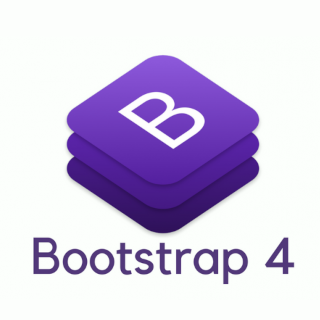

# ioBroker.vis-bootstrap4

[](https://www.npmjs.com/package/iobroker.vis-bootstrap4)
[](https://www.npmjs.com/package/iobroker.vis-bootstrap4)


[](https://david-dm.org/technicalguru/iobroker.vis-bootstrap4)
[](https://snyk.io/test/github/technicalguru/ioBroker.vis-bootstrap4)

[](https://nodei.co/npm/iobroker.vis-bootstrap4/)

## vis-bootstrap4 adapter for ioBroker
This adapter intends to provide basic Bootstrap 4 features for vis. The main target is to ease the creation of standard responsive design. It provides a few widgets in set "vis-bootstrap4" that are described here.

## Getting started

### General Note
* The adapter hides scrollbars to display better on touchpad devices.
* It is more convenient to define style attributes in CSS files (CSS tab in your view) instead of putting them in to each individual widget and/or view.
* Try to avoid absolute widget positioning. Use "relative" positioning and auto widths and height wherever possible. This will ensure best responsive behaviour.

### Naming Convention Proposal
Please think about a naming convention for your project before you start. Here is a recommendation:

* `_landingPage` - entry point into your application, the view VIS will open to start
* `pageXXX` - views that define complete pages
* `viewXXX` - views that are building blocks and will be combined within other pages
* `headerXXX` - views that you use for header bars
* `footerXXX` - views that you use for footer bars
* `menuXXX` - views that define (navigation) menus

This is a proposal only. The vis-bootstrap4 adapter does not assume any convention.

### Viewport Views
Layouts and grids (viewports) set their padding to 0. Hence, the view that you configure to show inside must define its own padding. Some helper CSS classes exist to define these paddings automatically:

* `vis-b4-p-5` - all paddings are 5px
* `vis-b4-p-5-10` - vertical padding 5px, horizontal padding 10px
* `vis-b4-p-10` - all paddings are 10px
* `vis-b4-p-10-15` - vertical padding 10px, horizontal padding 15px
* `vis-b4-p-15` - all paddings are 15px


## Widgets

### Layout
This widget provides a very common responsive 3-column layout that includes a header and a footer row. Add this widget to an empty view and configure the views that you want to use at the respective parts in the layout.

You can switch off individual parts except the main view. Make sure that you position the widget "relative" in section "CSS Common"

### Grid
This widget provides famous grid layout that has up to 12 columns. Add this widget to an empty view and configure the number of rows and cells. You can also specify the responsive grid breakpoint (default: `md` - medium) and the colspan of each cell. Please notice that the product of number of columns and column span shall not exceed 12. `Auto` is the default setting for the colspan value.

Views in the grid cells are configured by strings for each individual row. A single row's views are described as:

```
viewDescription1;viewDescription2;...;viewDescriptionN
```

Each description of a view in a row is separated by semicolon. The view description is:

```
viewName,cellSpan
```

The cellSpan is optional and defaults to `1`. Please notice that this refers to cells not grid columns. That means that setting column span to `3` and cellSpan to `2` will result in a grid layout column with span `6`.

## Developer manual
This section is intended for the developer. It can be deleted later

### Getting started

You are almost done, only a few steps left:
1. Create a new repository on GitHub with the name `ioBroker.vis-bootstrap4`
1. Initialize the current folder as a new git repository:  
    ```bash
    git init
    git add .
    git commit -m "Initial commit"
    ```
1. Link your local repository with the one on GitHub:  
    ```bash
    git remote add origin https://github.com/technicalguru/ioBroker.vis-bootstrap4
    ```

1. Push all files to the GitHub repo:  
    ```bash
    git push origin master
    ```
1. Head over to [widgets/vis-bootstrap4.html](widgets/vis-bootstrap4.html) and start programming!

### Best Practices
We've collected some [best practices](https://github.com/ioBroker/ioBroker.repositories#development-and-coding-best-practices) regarding ioBroker development and coding in general. If you're new to ioBroker or Node.js, you should
check them out. If you're already experienced, you should also take a look at them - you might learn something new :)

### Scripts in `package.json`
Several npm scripts are predefined for your convenience. You can run them using `npm run <scriptname>`
| Script name | Description                                              |
|-------------|----------------------------------------------------------|
| `test:package`    | Ensures your `package.json` and `io-package.json` are valid. |
| `test` | Performs a minimal test run on package files. |

### Publishing the widget
To get your widget released in ioBroker, please refer to the documentation 
of [ioBroker.repositories](https://github.com/ioBroker/ioBroker.repositories#requirements-for-adapter-to-get-added-to-the-latest-repository).

### Test the adapter manually on a local ioBroker installation
In order to install the adapter locally without publishing, the following steps are recommended:
1. Create a tarball from your dev directory:  
    ```bash
    npm pack
    ```
1. Upload the resulting file to your ioBroker host
1. Install it locally (The paths are different on Windows):
    ```bash
    cd /opt/iobroker
    npm i /path/to/tarball.tgz
    ```

For later updates, the above procedure is not necessary. Just do the following:
1. Overwrite the changed files in the adapter directory (`/opt/iobroker/node_modules/iobroker.vis-bootstrap4`)
1. Execute `iobroker upload vis-bootstrap4` on the ioBroker host

## Changelog

### 0.0.1
* (technicalguru) initial test release

## License
MIT License

Copyright (c) 2020 technicalguru <github@ralph-schuster.eu>

Permission is hereby granted, free of charge, to any person obtaining a copy
of this software and associated documentation files (the "Software"), to deal
in the Software without restriction, including without limitation the rights
to use, copy, modify, merge, publish, distribute, sublicense, and/or sell
copies of the Software, and to permit persons to whom the Software is
furnished to do so, subject to the following conditions:

The above copyright notice and this permission notice shall be included in all
copies or substantial portions of the Software.

THE SOFTWARE IS PROVIDED "AS IS", WITHOUT WARRANTY OF ANY KIND, EXPRESS OR
IMPLIED, INCLUDING BUT NOT LIMITED TO THE WARRANTIES OF MERCHANTABILITY,
FITNESS FOR A PARTICULAR PURPOSE AND NONINFRINGEMENT. IN NO EVENT SHALL THE
AUTHORS OR COPYRIGHT HOLDERS BE LIABLE FOR ANY CLAIM, DAMAGES OR OTHER
LIABILITY, WHETHER IN AN ACTION OF CONTRACT, TORT OR OTHERWISE, ARISING FROM,
OUT OF OR IN CONNECTION WITH THE SOFTWARE OR THE USE OR OTHER DEALINGS IN THE
SOFTWARE.